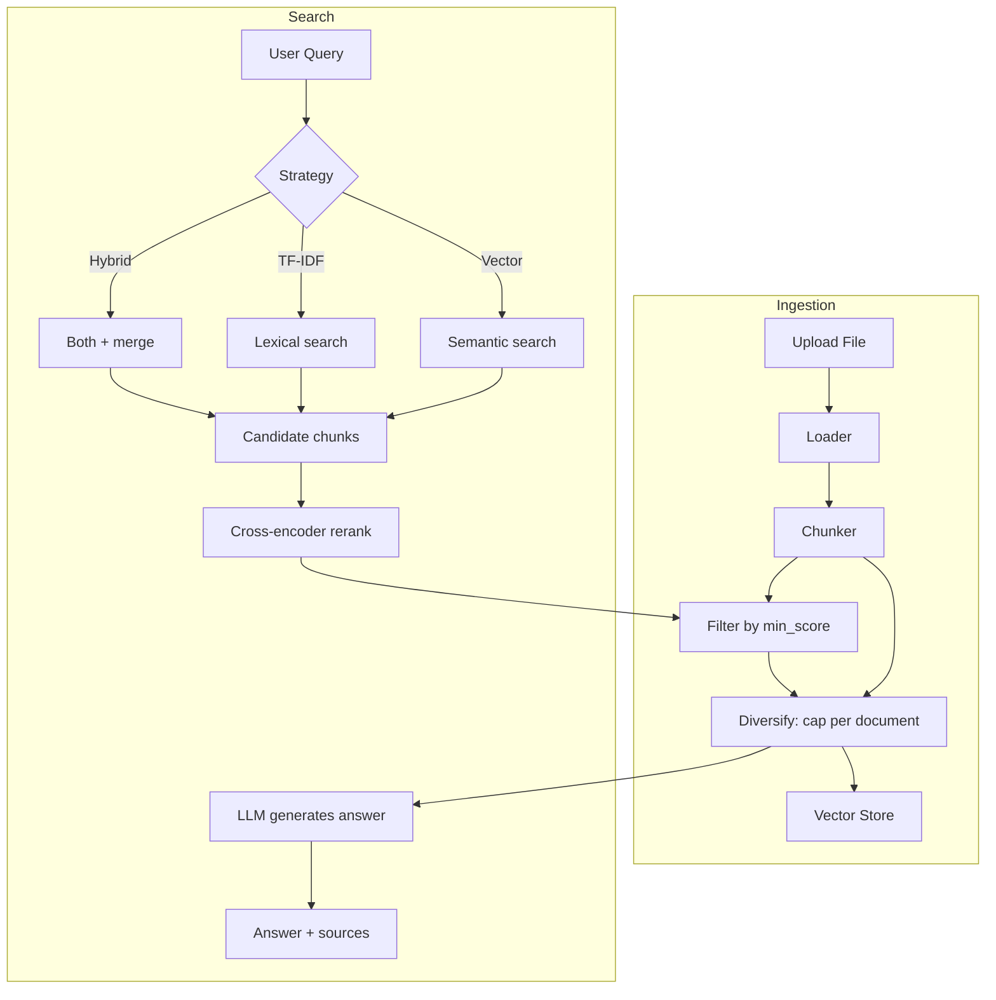

# Project Overview

## 1.1 What RAGBook is and what it's for

RAGBook is a local application that allows you to **load documents** (text, PDF, CSV, images), **index them** and **query them in natural language**. Instead of searching for exact words, RAGBook understands the *meaning* of your question and finds the most relevant passages in your documents, then uses a language model (LLM) to formulate a contextual answer.

Imagine having a personal library: instead of browsing every book, you have a librarian who knows the content of all volumes and can answer your questions citing the sources.

RAGBook runs entirely locally (with cloud option for the LLM) and does not require external services for indexing.

## 1.2 The problem: searching by meaning, not by words

Traditional search (like `Ctrl+F`) finds only exact matches. If you search "how to reduce costs", you won't find a paragraph that talks about "savings strategies" — yet the meaning is the same.

There are two complementary approaches to solve this problem:

- **Semantic search** (embeddings): transforms text and queries into numerical vectors in the same space. Texts with similar meaning end up close together, like cities in the same region on a map.
- **Lexical search** (TF-IDF): weights words by rarity. Excels with proper nouns, codes, acronyms — cases where exact matching matters.

RAGBook combines both in a **hybrid search**, taking the best of both worlds.

## 1.3 How it works in summary

The flow is divided into two phases: **ingestion** (loading and indexing) and **search** (querying and answering).

**Phase 1 — Ingestion:**
1. The file is loaded and read by the appropriate **loader** (PDF, text, CSV, image)
2. The content is split into **chunks** (fragments) by the chunker
3. Each chunk is transformed into a numerical vector (**embedding**) and saved in the **vector store**
4. The same chunks are also indexed with **TF-IDF**

**Phase 2 — Search:**
1. The user asks a question (the query is first cleaned of any mode/slash-command prefix)
2. The selected search strategy (vector, TF-IDF or hybrid) **over-fetches** candidates (4x with the reranker enabled — the default — 3x otherwise)
3. A **cross-encoder reranker** re-scores all candidates
4. Candidates are **filtered by `min_score`**, then **diversified** (a cap on chunks per document, cut to `top_k`)
5. The surviving chunks are passed as context to the **LLM**, which generates an answer based *only* on that context (RAG pattern). If the filter leaves no chunks, the LLM is **not** called.

## 1.4 The chosen technologies and why

| Component | Technology | Why |
|---|---|---|
| REST API | **FastAPI** | Asynchronous, fast, automatic validation with Pydantic |
| User interface | **Gradio** | Functional UI with few lines of code |
| Vector store | **FAISS** (default) / ChromaDB / Pinecone / Qdrant | FAISS is very fast and local; ChromaDB, Pinecone, and Qdrant are supported alternatives |
| Embeddings | **Sentence Transformers** (`Qwen/Qwen3-Embedding-4B` default, ~2560 dim) | Free, local, strong multilingual quality |
| Lexical search | **scikit-learn** TfidfVectorizer | Established library, easy to use |
| Chunking | **LangChain Text Splitters** | RecursiveCharacterTextSplitter handles different types of text well |
| LLM | **Google Gemini** / **Ollama** | Gemini for quality (cloud), Ollama for total privacy (local) |
| Metadata | **SQLite** (aiosqlite) | Lightweight, zero configuration, asynchronous |
| Configuration | **pydantic-settings** | Type-safe, reads from `.env`, automatic validation |
| Data validation | **Pydantic v2** | De facto standard for data models in modern Python |

The key architectural choice is **Clean Architecture** with ports and adapters (covered in depth in [chapter 2](02-architecture.md)), which allows swapping any technology without touching the application logic.

## 1.5 Glossary of key terms

**Embedding**
Numerical representation (vector) of a text. Texts with similar meaning produce vectors close together in space. Like GPS coordinates: two nearby points on the map are also close in reality.

**Chunk**
Fragment of a document. Documents are split into chunks because LLMs have a context limit and because smaller fragments produce more precise search results.

**Collection**
Logical group of documents. Allows organizing documents by topic and limiting search to a specific subset.

**RAG (Retrieval Augmented Generation)**
Pattern that combines retrieval and generation: first *retrieves* relevant passages from documents, then *injects* them into the LLM's prompt as context. The LLM answers based on real data instead of hallucinating.

**TF-IDF (Term Frequency - Inverse Document Frequency)**
Statistical method that weights words by importance: a word frequent in the document but rare in the overall corpus has high weight. Produces *sparse* vectors (most values are zero).

**Cosine Similarity**
Measure of similarity between two vectors based on the angle between them. Value 1 = identical, 0 = no relation. It is the metric by which distances are measured in the vector store.

**Vector Store**
Specialized database for storing and searching vectors efficiently. In RAGBook: FAISS (default), ChromaDB, Pinecone, or Qdrant.

**Port**
Abstract interface that defines *what* a component must be able to do, without specifying *how*. Example: "must be able to generate embeddings" — without saying which library or provider implements it.

**Adapter**
Concrete implementation of a port. Connects the external world (libraries, APIs, databases) to the application logic through the contract defined by the port.

**Clean Architecture**
Organization of code in concentric layers where dependencies always point inward (toward the domain). The domain never knows about the infrastructure, never the other way around. Deep dive in [chapter 2](02-architecture.md).
