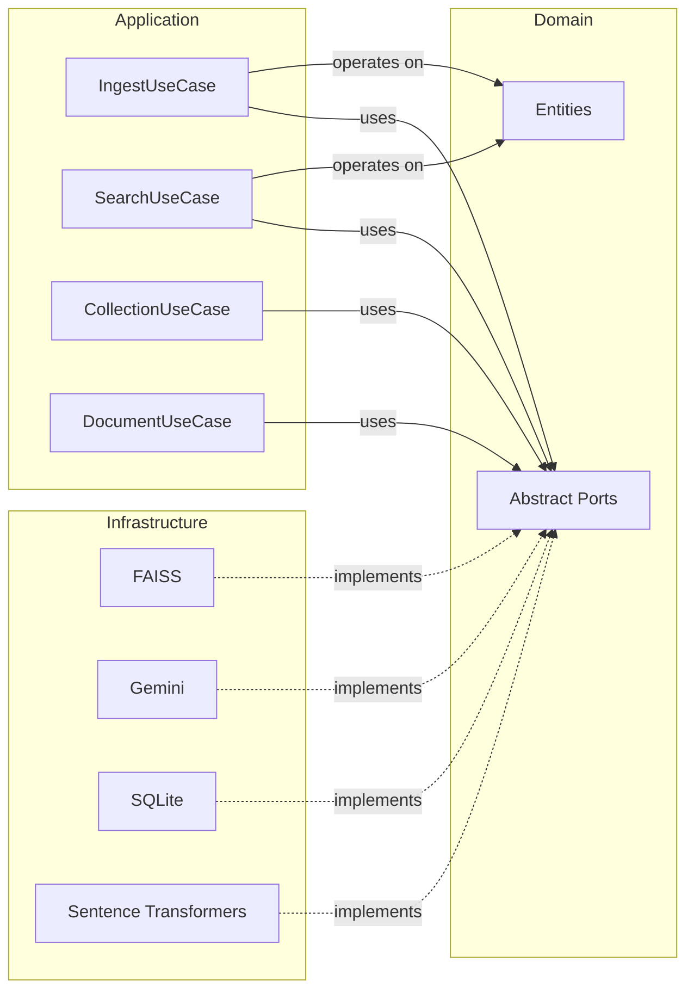
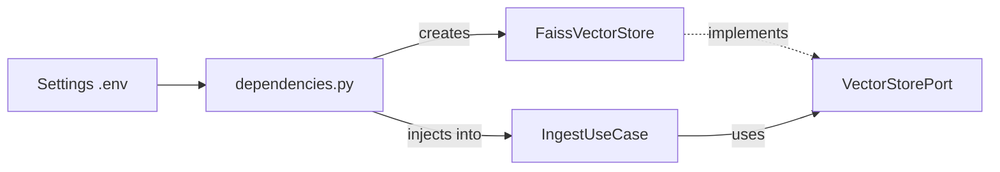

# Architecture

## 2.1 What Clean Architecture is

Imagine a restaurant. The **customer** orders from the menu without knowing how the kitchen works. The **chef** prepares dishes following recipes, without worrying about which brand of oven is used. The **oven** is a replaceable tool: if it breaks, you buy another one — the recipes stay the same.

Clean Architecture applies the same principle to software:

- **Domain** (the recipes): the fundamental rules, independent of any technology
- **Application** (the chef): orchestrates operations using domain rules
- **Infrastructure** (the oven, the stoves): the concrete tools, replaceable

The golden rule: **dependencies always point inward**. The domain doesn't know that FAISS exists. The application doesn't know whether you're using Gemini or Ollama. Only the infrastructure knows the concrete details.



## 2.2 The three layers: Domain → Application → Infrastructure

### 2.2.1 Domain: the rules of the game

The domain is the heart of the application. It contains two things: **entities** (data) and **ports** (contracts).

**Entities** (`src/domain/entities.py`) describe the fundamental concepts:

```python
class Document(BaseModel):
    id: UUID = Field(default_factory=uuid4)
    filename: str
    document_type: DocumentType
    content: str
    collection_id: UUID | None = None
```

Five entities model the domain: `Document` (an uploaded file), `Chunk` (a document fragment), `SearchResult` (a search result with score), `Collection` (a group of documents) and `SearchQuery` (a search request).

**Enums** (`src/domain/enums.py`) define allowed values: `DocumentType` (TEXT, PDF, CSV, IMAGE) and `SearchStrategy` (VECTOR, TFIDF, HYBRID).

**Ports** (`src/domain/ports/`) are abstract interfaces — the contract that every external tool must respect. Think of electrical outlets: the shape of the outlet (the port) is standard, any compatible device (the adapter) can plug in.

RAGBook defines 9 ports:

| Port | Responsibility |
|---|---|
| `DocumentLoaderPort` | Load a file and return a `Document` |
| `ChunkerPort` | Split a document into `Chunk`s |
| `EmbeddingPort` | Transform texts into numerical vectors |
| `VectorStorePort` | Save and search vectors (add, search, save, load) |
| `TfidfPort` | Index and search with TF-IDF |
| `LlmPort` | Generate a text response given a prompt and a context |
| `SearchPort` | Orchestrate the search strategy |
| `RerankerPort` | Re-score candidate chunks with a cross-encoder |
| `MetadataStorePort` | Persist collections, documents, and chunks |

Each port is an abstract class with `async` methods:

```python
class EmbeddingPort(ABC):
    @abstractmethod
    async def embed(self, texts: list[str]) -> list[list[float]]: ...

    @abstractmethod
    async def embed_query(self, text: str) -> list[float]: ...

    @abstractmethod
    def dimension(self) -> int: ...   # synchronous
```

### 2.2.2 Application: the use cases

The application layer (`src/application/`) contains the **orchestration logic**: it knows *what* to do, but not *how*. It delegates the "how" to the ports.

Four use cases cover the main operations:

**IngestUseCase** — the loading flow:

```python
async def execute(self, file_path, document_type, collection_id: str):
    document = await self._loader.load(file_path, document_type)
    chunks = await self._chunker.chunk(document)

    # Embed + index in batches (INGEST_BATCH_SIZE = 500) to cap memory
    for i in range(0, len(chunks), INGEST_BATCH_SIZE):
        batch = chunks[i : i + INGEST_BATCH_SIZE]
        embeddings = await self._embedding.embed([c.content for c in batch])
        # attach embeddings to batch chunks...
        await self._vector_store.add(batch, coll_id)

    await self._vector_store.save()          # persist before fitting TF-IDF
    await self._tfidf.fit(chunks, coll_id)
    await self._metadata_store.save_document(document)
    await self._metadata_store.save_chunks(chunks)
    return document, chunks
```

The flow is linear: load → split → vectorize (batched) → persist. `collection_id` is **required** (a `str`), not optional. All collaborators, including the metadata store, are injected as ports (`MetadataStorePort`, see §2.3) — enforced by `lint-imports` (5 contracts in `pyproject.toml`).

**SearchUseCase** — two modes:
- `execute()`: finds relevant chunks, passes context to the LLM, returns answer + sources
- `execute_raw()`: returns only chunks without involving the LLM

**CollectionUseCase** — collection management: creation, listing, and deletion (with cascade cleanup of vector store, TF-IDF indexes, and SQLite metadata).

**DocumentUseCase** — per-document operations: list, get, and delete a document (with cleanup of its chunks across vector store, TF-IDF, and metadata).

### 2.2.3 Infrastructure: the concrete tools

The infrastructure (`src/infrastructure/`) contains the **adapters**: concrete implementations of the ports.

The structure:

```
infrastructure/
├── loaders/        → TextLoader, PdfLoader, CsvLoader, ImageLoader
├── chunkers/       → RecursiveChunker, SemanticChunker, CsvChunker
├── embeddings/     → SentenceTransformerEmbedding
├── vector_stores/  → FaissVectorStore, ChromaVectorStore, PineconeVectorStore, QdrantVectorStore
├── tfidf/          → SklearnTfidf
├── rerankers/      → CrossEncoderReranker
├── search/         → VectorSearch, TfidfSearch, HybridSearch, SearchDispatcher
├── llm/            → GeminiLlm, OllamaLlm
└── persistence/    → SqliteMetadataStore
```

Each adapter implements exactly one port and can be swapped without touching the rest of the code.

## 2.3 Dependency Injection: how the pieces connect without knowing each other

The problem: if the use case directly created its tools (`self._store = FaissStore()`), it would be coupled to FAISS. To switch to ChromaDB you would have to modify the use case.

The solution: **inject dependencies from the constructor**. The use case declares what it needs (the ports), someone else decides what to provide (the adapters).

```python
class IngestUseCase:
    def __init__(
        self,
        loader: DocumentLoaderPort,
        chunker: ChunkerPort,
        embedding: EmbeddingPort,
        vector_store: VectorStorePort,
        tfidf: TfidfPort,
        metadata_store: MetadataStorePort,
    ) -> None:
        self._loader = loader
        self._chunker = chunker
        ...
```

The "someone else" will be the `dependencies.py` module, which reads the configuration and assembles the pieces:



## 2.4 Why this structure

This architecture seems more complex than necessary for a small project. So why use it?

**1. Swap technologies in one line.**
Want to switch from FAISS to ChromaDB? Change one line in the configuration (`VECTOR_STORE=chroma`). The factory in `dependencies.py` will instantiate `ChromaVectorStore` instead of `FaissVectorStore`. Use cases don't change — they talk to `VectorStorePort`, not to the implementation.

**2. Test without external dependencies.**
You can create port mocks for unit tests. You don't need FAISS installed or an active LLM to test that `IngestUseCase` correctly orchestrates the flow.

**3. Add features without breaking existing ones.**
Want a new loader type (e.g. DOCX)? Create an adapter that implements `DocumentLoaderPort` and register it in the factory. No existing files are modified.

**4. Readability.**
Each layer has a clear responsibility. To understand *what* the app does, read `application/`. To understand *how* it does it, read `infrastructure/`. To understand *what data* it works with, read `domain/`.

As seen in the [project overview](01-project-overview.md), RAGBook supports multiple interchangeable technologies (FAISS/ChromaDB, Gemini/Ollama, vector/TF-IDF/hybrid). Without this architecture, every combination would require `if/else` scattered throughout the code. With ports, each variant is an autonomous and cohesive adapter.
