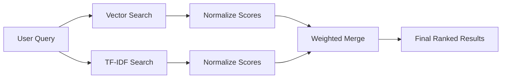
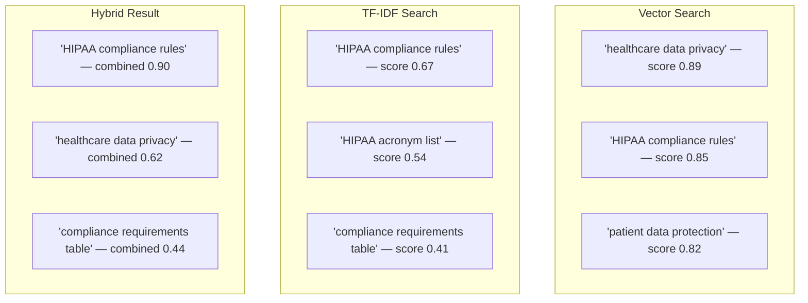
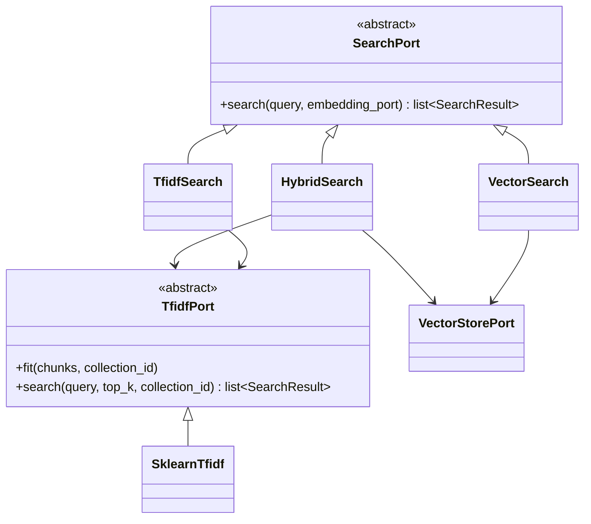

# 5. TF-IDF and Hybrid Search — Finding the Right Words

In [chapter 4](04-embeddings-and-vector-store.md) we saw how embeddings capture the *meaning* of text, placing sentences on a vast semantic map. But we also noticed a limitation: embeddings can struggle with exact terms, product codes, and rare jargon. This chapter introduces **TF-IDF** — a classic technique that excels precisely where embeddings falter — and shows how RAGBook combines both into a **hybrid search** that gets the best of both worlds.

## 5.1 TF-IDF Explained with a Concrete Example

Imagine you are a librarian and a visitor asks for books about "photosynthesis." You could count how many times the word appears in each book (that is useful), but you should also consider that common words like "the" appear everywhere and tell you nothing. TF-IDF formalizes exactly this intuition: it rewards words that appear often *in a specific document* but penalizes words that appear in *every* document.

### 5.1.1 Term Frequency: Counting Words

**Term Frequency (TF)** answers a simple question: *how prominent is this word in this particular chunk?*

If the word "photosynthesis" appears 5 times in a 100-word chunk, its TF is 5/100 = 0.05. A chunk that mentions the term more often is probably more relevant to a query about photosynthesis. Nothing surprising so far.

### 5.1.2 Inverse Document Frequency: Weighting Rarity

**Inverse Document Frequency (IDF)** answers a different question: *how rare is this word across all chunks?*

The word "the" might appear in every single chunk — its IDF is very low, almost zero. The word "photosynthesis" might appear in only 3 out of 1000 chunks — its IDF is high. Multiplying TF by IDF gives you a score that is high only when a word is both frequent in the current chunk *and* rare across the corpus.

This is the core insight: **rarity is what makes a term informative.**

### 5.1.3 Sparse Vectors: Most Dimensions Are Zero

When TF-IDF processes a corpus, it creates a vocabulary of every unique word it encounters. Each chunk is then represented as a vector with one dimension per word. If the vocabulary has 10,000 words, each chunk gets a 10,000-dimensional vector — but most values are zero, because any single chunk only uses a tiny fraction of the total vocabulary.

These are called **sparse vectors** — in contrast to the **dense vectors** produced by embedding models (see [chapter 4, section 4.1](04-embeddings-and-vector-store.md)). Dense vectors are comparatively short (2560 dimensions for RAGBook's default `Qwen/Qwen3-Embedding-4B`) and every dimension has a non-zero value. Sparse vectors are long and mostly empty, but they preserve exact word-level information that dense vectors throw away.

In RAGBook, the `SklearnTfidf` adapter uses scikit-learn's `TfidfVectorizer` to build these sparse vectors:

```python
vectorizer = TfidfVectorizer()
corpus = [chunk.content for chunk in all_chunks]
matrix = vectorizer.fit_transform(corpus)
```

The resulting `matrix` is a sparse matrix where each row is a chunk and each column is a term from the vocabulary. At search time, the query is transformed into the same space and compared using **cosine similarity** — the same metric used for dense vectors, just applied to a much wider, mostly-empty space.

## 5.2 When TF-IDF Beats Embeddings

Embeddings understand that "car" and "automobile" mean the same thing. That is powerful. But consider these scenarios:

- **Product codes**: Searching for "SKU-4872" — an embedding model may map this to a generic region, losing the exact identifier. TF-IDF matches it precisely.
- **Proper names**: Searching for "Dr. Montessori" — the embedding may capture something about education, but TF-IDF finds the exact name.
- **Acronyms and jargon**: Searching for "HIPAA compliance" — TF-IDF matches the acronym character-by-character, while an embedding might conflate it with general healthcare concepts.
- **Rare technical terms**: A domain-specific word that appeared rarely in the embedding model's training data gets a vague vector. TF-IDF does not care about training data — it only cares about *your* corpus.

The rule of thumb: **if the exact characters matter, TF-IDF wins. If the meaning matters, embeddings win.** The best approach is to use both.

## 5.3 Hybrid Search: The Best of Both Worlds

RAGBook's `HybridSearch` runs both a vector search and a TF-IDF search **in parallel**, then merges their results into a single ranked list. Think of it as asking two different experts the same question and combining their opinions.



Both searches happen concurrently using `asyncio.gather`, so the total time is roughly the time of the *slower* of the two — not the sum:

```python
vector_results, tfidf_results = await asyncio.gather(
    _vector_search(), _tfidf_search()
)
```

If either search fails (network issue, missing index), the hybrid strategy gracefully falls back to whichever search succeeded.

### 5.3.1 Score Normalization

Vector search and TF-IDF search produce scores on completely different scales. A vector cosine similarity might range from 0.12 to 0.87, while a TF-IDF cosine similarity might range from 0.002 to 0.45. You cannot simply add them — the vector scores would dominate.

RAGBook solves this with **max normalization**, which divides every score by the largest score in its own list, rescaling each set to the 0-1 range:

```python
normalized = score / max_score
```

After normalization, the best result in each list gets a score of 1.0 and every other result keeps its magnitude *relative* to that best one (the worst is not forced to 0.0 — it retains whatever fraction of the top score it earned). When all scores in a list are equal, they all become 1.0. The one guarded corner case is `max_score == 0` (nothing matched): every result then receives 0.0 to avoid dividing by zero.

### 5.3.2 Weighted Merge: How Scores Are Combined

Once scores are normalized, RAGBook combines them using a weighted sum. For each chunk, its final score is:

```
final_score = vector_weight * vector_score + (1 - vector_weight) * tfidf_score
```

If a chunk appears in both result sets, its scores are added together. If it appears in only one, it receives a weighted score from that source alone. Results are then sorted by final score and the top-K are returned.

This approach means a chunk that scores well in *both* strategies floats to the top — it is both semantically relevant and contains the right keywords.

### 5.3.3 The Configurable Weight (70/30) and How to Tune It

The default weight in RAGBook is **0.7 for vector search** and **0.3 for TF-IDF**, configured via the `hybrid_vector_weight` setting:

```python
hybrid_vector_weight: float = 0.7
```

You can adjust this in your `.env` file:

```
HYBRID_VECTOR_WEIGHT=0.7
```

**Tuning guidance:**

| Scenario | Suggested Weight | Why |
|----------|-----------------|-----|
| General Q&A, natural language | 0.8 vector / 0.2 TF-IDF | Meaning matters more than exact words |
| Technical documentation with codes | 0.5 / 0.5 | Both exact terms and context matter equally |
| Legal or regulatory text | 0.4 / 0.6 | Precise terminology is critical |
| Mixed corpus (default) | 0.7 / 0.3 | Good all-around starting point |

There is no universally correct value. Start with 0.7, run a few representative queries, and adjust based on whether the results feel too "fuzzy" (lower the vector weight) or too "literal" (raise it).

## 5.4 Practical Example: Same Query, Three Strategies Compared

Suppose your corpus contains technical documentation and a user searches for **"HIPAA compliance requirements"**. Here is how each strategy would behave:

| Strategy | What It Does | Likely Top Result |
|----------|-------------|-------------------|
| **Vector only** | Finds chunks *about* healthcare regulations, privacy rules, legal compliance — even if they never mention "HIPAA" by name | A chunk discussing "healthcare data privacy standards" |
| **TF-IDF only** | Finds chunks containing the exact words "HIPAA", "compliance", "requirements" — even if a chunk just lists acronyms in a table | A chunk with a table of regulatory acronyms |
| **Hybrid (0.7/0.3)** | Finds chunks that are both *about* compliance AND mention "HIPAA" explicitly — the semantic understanding ensures relevance, the keyword matching ensures precision | A chunk that explains HIPAA compliance requirements in context |

The hybrid approach surfaces results that neither strategy would rank first on its own. The vector component provides recall (finding relevant content), while TF-IDF provides precision (ensuring the right terms are present).



Notice how "HIPAA compliance rules" — which ranked well in *both* individual searches — rises to the top in the hybrid result. That is the power of combining complementary signals.

## 5.5 Architecture Summary

All search strategies implement the same `SearchPort` interface, making them interchangeable:



At startup the composition root instantiates **all three** wired strategies — `VectorSearch`, `TfidfSearch`, and `HybridSearch` — and hands them to a `SearchDispatcher`. The `search_strategy` setting does not pick *one* implementation to build; it only sets the dispatcher's **default**. Any individual request may override it by passing a `strategy` field, so a single running server can answer some queries with `hybrid` and others with `tfidf`. Valid values are `"vector"`, `"tfidf"`, and `"hybrid"` — these are the only members of the `SearchStrategy` enum, and an unknown value crashes at startup.

---

Next: [Chapter 6 — LLM and Generation](06-llm-and-generation.md) | Previous: [Chapter 4 — Embeddings and Vector Stores](04-embeddings-and-vector-store.md)
