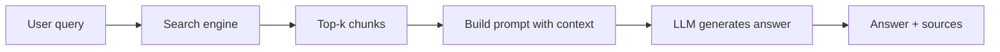

# 6. LLM and Generation — From Search to Answer

In [chapter 5](05-tfidf-and-hybrid-search.md) we built a powerful search engine that combines semantic understanding (embeddings) with exact word matching (TF-IDF). But the search engine only returns *chunks* of text — raw fragments from your documents. The user still has to read through them and piece together an answer. This chapter shows how RAGBook uses a **Large Language Model (LLM)** to do that synthesis automatically, turning retrieved chunks into a coherent, natural-language answer.

This is the final piece of the puzzle: the pattern known as **RAG** — Retrieval Augmented Generation.

## 6.1 The RAG Pattern: Retrieval Augmented Generation

### 6.1.1 Why You Cannot Just Ask the LLM Everything

It is tempting to skip the search step entirely and just send your question to a large language model like Gemini or Llama. After all, these models have been trained on vast amounts of text — surely they know the answer?

The problem is threefold:

1. **Knowledge cutoff.** The model was trained on data up to a certain date. It knows nothing about your private documents, internal reports, or recently published papers.
2. **Hallucination.** When an LLM does not know something, it does not say "I don't know." It *invents* a plausible-sounding answer. This is dangerous in any context where accuracy matters.
3. **No source attribution.** Even when the model gives a correct answer, you have no way to verify *where* that information came from.

RAG solves all three problems by grounding the LLM in your actual documents. The model does not need to "know" the answer — it just needs to read the relevant context and summarize it.

### 6.1.2 The Flow: Retrieve → Inject → Generate

Think of it like giving an open-book exam. The student (the LLM) receives the question *and* the relevant pages from the textbook (the retrieved chunks). Their job is to read the provided material and write a clear answer — not to rely on memory.



In RAGBook, this flow lives in the `SearchUseCase`:

```python
# 1. Retrieve the most relevant chunks
results = await self._search.search(query, self._embedding)
# 2. Extract their text content
context = [result.chunk.content for result in results]
# 3. Ask the LLM to generate an answer grounded in that context
answer = await self._llm.generate(query.query, context)
```

The use case does not know *which* LLM it is talking to — it only knows the `LlmPort` interface. This is Clean Architecture at work (see [chapter 2](02-architecture.md)).

## 6.2 The RAG Prompt: Instructing the Model

The quality of a RAG system depends heavily on how you instruct the LLM. A vague prompt like "answer this question" gives the model too much freedom and leads to formulaic responses ("Based on the provided context..."). RAGBook uses a carefully structured prompt template defined in a shared module (`src/infrastructure/llm/prompts.py`):

```python
_RAG_PROMPT_TEMPLATE = """\
You are an expert document-consultation assistant.
Your job is to answer the user's question using the retrieved documents below.

Rules:
- NEVER mention "the context", "the provided documents", "based on the documents",
  or similar meta-references. Answer as if the knowledge were your own.
- {mode_instruction}
- If the documents do not contain enough information, briefly state what is missing
  and supplement with your own knowledge, clearly marking it as your addition.
- Answer in the same language as the question.

DOCUMENTS:
{context}

QUESTION:
{prompt}

ANSWER:
"""
```

Key design choices:

1. **Role assignment** — "You are an expert document-consultation assistant" gives the model an identity and sets a professional tone.
2. **No meta-references** — The explicit ban on phrases like "from the provided context" eliminates formulaic filler. The model answers as if the knowledge were its own.
3. **Language matching** — "Answer in the same language as the question" ensures the response language adapts to the user automatically.
4. **Graceful fallback** — When documents are insufficient, the model states what is missing and supplements with its own knowledge (clearly marked), instead of just refusing to answer.
5. **Mode instruction slot** — The `{mode_instruction}` placeholder is filled dynamically based on the output mode (see section 6.2.1).

### 6.2.1 Output Modes

Users can prefix their query with a slash-command to control the style of the answer. The `parse_mode()` function (`src/domain/query_mode.py`) extracts the prefix and returns the cleaned query, while `build_rag_prompt()` injects mode-specific instructions into the template.

| Prefix | Mode | Behavior |
|--------|------|----------|
| `/explain` | Explain | Thorough, didactic explanation with step-by-step breakdowns and examples |
| `/summary` | Summary | Concise bullet points, key facts only, no extra commentary |
| `/commands` | Commands | Numbered list of actionable steps/commands — no introductions or explanations |
| `/analyze` | Analyze | Critical analysis with strengths, weaknesses, trade-offs, and alternatives |
| *(no prefix)* | Default | Clear, well-structured answer with interpretation where it adds value |

Example usage:

```
/summary What are the main optimization techniques?
/explain How does hybrid search combine vector and TF-IDF results?
/commands How do I set up a new collection and upload documents?
```

The mode is parsed from the query string before it reaches the search engine, so the retrieval step sees only the clean question. This keeps retrieval quality unaffected by the mode prefix.

```python
mode, clean_prompt = parse_mode(prompt)        # extract /mode prefix
context_text = truncate_context(context)        # join and truncate chunks
full_prompt = build_rag_prompt(clean_prompt, context_text, mode)
```

### 6.2.2 Context Truncation

LLMs have a finite input window (measured in tokens). If you retrieved 50 chunks, concatenating them all might exceed that limit. RAGBook handles this with the shared `truncate_context()` function:

```python
MAX_CONTEXT_CHARS = 30_000

def truncate_context(context: list[str]) -> str:
    parts = []
    total = 0
    for i, chunk in enumerate(context, 1):
        entry = f"[{i}] {chunk}"
        if total + len(entry) > MAX_CONTEXT_CHARS:
            break
        parts.append(entry)
        total += len(entry)
    return "\n\n".join(parts)
```

Each chunk is numbered (`[1]`, `[2]`, ...) so the model can reference them. The method keeps adding chunks until the 30,000-character budget is exhausted, then stops. This ensures the prompt never exceeds a safe size, while prioritizing the most relevant chunks (which come first, since the search engine already ranked them by score).

## 6.3 Multiple Adapters: Gemini (Cloud) vs Ollama (Local)

RAGBook follows the same adapter pattern used throughout the project. The domain defines a minimal port:

```python
class LlmPort(ABC):
    @abstractmethod
    async def generate(self, prompt: str, context: list[str]) -> str: ...
```

Two concrete adapters implement this port, giving you a choice between cloud and local inference. Both delegate prompt construction and context truncation to the shared `prompts` module — no prompt logic is duplicated.

### Gemini — Cloud Power

The `GeminiLlm` adapter uses Google's Gemini API via LangChain. It requires a `GOOGLE_API_KEY` in your `.env` file and offers high-quality generation with fast response times.

Under the hood, it creates a `ChatGoogleGenerativeAI` instance configured with `settings.llm_temperature` (default `0.3`, via `LLM_TEMPERATURE`) — low enough for factual accuracy, slightly raised to avoid overly repetitive phrasing.

### Ollama — Local Privacy

The `OllamaLlm` adapter talks to a locally running [Ollama](https://ollama.ai) instance via its HTTP API. No API key is needed, no data leaves your machine — everything runs on your own hardware.

This adapter uses raw `httpx` calls rather than a LangChain wrapper, keeping dependencies minimal. It sends a POST request to the **chat** endpoint `/api/chat` with streaming disabled, a `messages` array (chat format, not a raw `prompt`), and `temperature`/`num_ctx` pulled from settings. The optional `think` field is only included when `LLM_THINK=true` — older Ollama versions reject it. The reply is read from `response.json()["message"]["content"]`:

```python
payload = {
    "model": self._model,
    "messages": [{"role": "user", "content": full_prompt}],
    "stream": False,
    "options": {"temperature": self._temperature, "num_ctx": self._num_ctx},
}
if self._think:                     # only when LLM_THINK=true
    payload["think"] = True

async with httpx.AsyncClient(timeout=self._timeout) as client:
    response = await client.post(f"{self._base_url}/api/chat", json=payload)
    response.raise_for_status()
    return response.json()["message"]["content"]
```

The timeout is `settings.llm_timeout` (default **300s**, via `LLM_TIMEOUT`), accounting for the fact that local inference on CPU can be significantly slower than cloud APIs, especially with larger models.

### Choosing Between Them

| Aspect | Gemini | Ollama |
|--------|--------|--------|
| Setup | API key required | `ollama serve` + model pull |
| Privacy | Data sent to Google | Everything stays local |
| Speed | Fast (cloud GPUs) | Depends on hardware |
| Cost | Free tier available, then pay-per-token | Free (your electricity) |
| Quality | High (large model) | Varies by model size |

The choice is made via the `LLM_PROVIDER` setting in your `.env` file — no code changes needed.

## 6.4 Limits and Trade-offs

RAG is powerful, but it is not magic. Understanding its limitations helps you use it effectively:

- **Context window.** The 30,000-character budget means only a fraction of your documents reaches the LLM. If the answer spans many chunks spread across a large corpus, some relevant information may be truncated. The quality of the *search* step is therefore critical — better retrieval means better answers.
- **Context quality.** The LLM can only work with what it receives. If the search returns irrelevant chunks (due to a vague query or poorly chunked documents), the answer will be poor regardless of how capable the model is. This is the "garbage in, garbage out" principle applied to RAG.
- **Latency.** Adding an LLM call introduces significant latency compared to search-only results. Cloud APIs typically respond in 1-3 seconds; local models on CPU might take 10-30 seconds or more. This is why RAGBook also offers a `execute_raw` method that returns search results without LLM generation — useful when you just want to find relevant chunks quickly.
- **Token cost.** Cloud LLM APIs charge per token. Longer contexts mean higher costs per query. The truncation strategy helps control this, but for high-volume usage, local models with Ollama may be more economical.

---

**Next:** In [chapter 7](07-api-and-interface.md) we will see how the API and user interface tie everything together, making RAGBook accessible through both REST endpoints and a visual Gradio interface.
