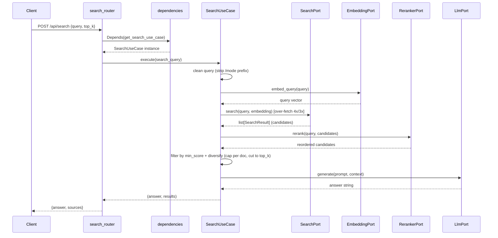

# 7. API and Interface — How to Use RAGBook

In the previous chapters we built every component of the pipeline: document loading ([chapter 3](03-loading-documents.md)), embeddings and vector search ([chapter 4](04-embeddings-and-vector-store.md)), hybrid retrieval ([chapter 5](05-tfidf-and-hybrid-search.md)), and LLM-powered answer generation ([chapter 6](06-llm-and-generation.md)). But all of these are internal pieces — invisible to the end user.

This chapter shows how RAGBook exposes everything through a **REST API** built with FastAPI, making it possible to upload documents, search your knowledge base, and manage collections via simple HTTP calls.

## 7.1 The REST API: Main Endpoints

RAGBook's API follows a clean, predictable structure. Every endpoint lives under the `/api` prefix and uses JSON for request and response bodies.

### 7.1.1 Application Startup

Before any endpoint can serve requests, the application needs to initialize its infrastructure. RAGBook uses FastAPI's **lifespan** mechanism to handle this:

```python
@asynccontextmanager
async def lifespan(app: FastAPI):
    settings.validate_llm()
    metadata_store = get_metadata_store()
    vector_store = get_vector_store()
    await metadata_store.init_db()
    await vector_store.load()
    await _warn_incompatible_collections(metadata_store)
    yield
```

Four things happen at startup:

1. **LLM config validation** — `settings.validate_llm()` checks that `LLM_PROVIDER` is set to a known value (`"gemini"` or `"ollama"`) and that `LLM_MODEL` is set. If either is missing or unknown it raises `ConfigurationError` and the process exits before accepting any requests.
2. **Database init** — the SQLite store creates its tables if they do not exist yet.
3. **Vector store load** — the FAISS (or other) index is loaded from disk into memory.
4. **Compatibility scan** — `_warn_incompatible_collections` iterates all collections; any whose stored `embedding_model` or `embedding_dimension` differs from the current settings emits a `WARNING` log (re-ingest required).

CORS is configured via middleware using the origins listed in `CORS_ORIGINS` (comma-separated, default `http://localhost:8000,http://127.0.0.1:8000`). Add or override origins in `.env` as needed.

### 7.1.2 Uploading Documents

**`POST /api/ingest`** — Upload a file to index it.

This endpoint accepts a file via `multipart/form-data` along with a **required** `collection_id`. The collection must already exist — an unknown `collection_id` is rejected with a `404` ("Create a collection first"). It detects the document type from the file extension:

| Extension | Document Type |
|-----------|--------------|
| `.txt`, `.md` | TEXT |
| `.pdf` | PDF |
| `.csv` | CSV |
| `.png`, `.jpg`, `.jpeg` | IMAGE |

Before touching disk, the router computes a SHA-256 hash of the uploaded bytes and checks whether the same content was already ingested into that collection. If it was, the pipeline is skipped and the existing document is returned immediately:

```json
{
  "document_id": "a3f8...",
  "filename": "report.pdf",
  "num_chunks": 42,
  "collection_id": "my-collection",
  "already_ingested": true
}
```

If the content is new, the file is saved to disk with a UUID prefix (to avoid name collisions), then the full pipeline runs: load → chunk → embed → store. The response is the same shape with `already_ingested: false`.

The router also calls `check_model_compatibility` before hashing: if the collection was created with a different embedding model or dimension than the one currently configured, the endpoint returns **409** — re-ingest into a new or matching collection is required.

Unsupported file types are rejected with a `400` error.

### 7.1.3 Searching With and Without LLM

RAGBook offers two search endpoints — one that generates a natural-language answer, and one that returns raw chunks.

**`POST /api/search`** — Full search with LLM answer.

Request body:

```json
{
  "query": "What are the main findings?",
  "collection_id": "<uuid-of-an-existing-collection>",
  "top_k": 5,
  "strategy": "hybrid"
}
```

All fields except `query` **and `collection_id`** are optional — a search always targets one collection (malformed id → `400`, unknown collection → `404`). The `strategy` field accepts `"vector"`, `"tfidf"`, or `"hybrid"` — if omitted, the system default from settings is used.

#### Output Modes

You can prefix the `query` with a slash-command to control the style of the LLM answer (see [chapter 6, section 6.2.1](06-llm-and-generation.md) for details):

```json
{ "query": "/summary What are the main findings?" }
{ "query": "/explain How does hybrid search work?" }
{ "query": "/commands How do I deploy the service?" }
{ "query": "/analyze What are the trade-offs of vector vs hybrid search?" }
```

The prefix is stripped before retrieval, so search quality is unaffected. If no prefix is given, a balanced default style is used.

Response:

```json
{
  "answer": "The main findings are...",
  "sources": [
    {
      "chunk_content": "In section 3 we found that...",
      "score": 0.87,
      "document_filename": "report.pdf"
    }
  ]
}
```

The `sources` array gives you full traceability: you can see exactly which chunks the LLM used to build its answer, along with their relevance scores and original filenames.

**`POST /api/search/raw`** — Retrieval only, no LLM.

Same request format, but the response contains only `sources` — no `answer` field. This is useful when you want fast results without waiting for the LLM, or when you want to inspect what the search engine returns before asking for a generated answer.

### 7.1.4 Managing Collections

Collections let you organize your documents into separate knowledge bases. Three endpoints handle the full lifecycle:

- **`POST /api/collections`** — Create a new collection. Body: `{ "name": "...", "description": "..." }`.
- **`GET /api/collections`** — List all collections. Returns an array of collection objects with `id`, `name`, `description`, and `created_at`.
- **`DELETE /api/collections/{collection_id}`** — Delete a collection and **all** its associated data (documents, chunks, vector store entries, TF-IDF indexes).

### 7.1.5 Managing Documents

Documents are always addressed through their collection:

- **`GET /api/collections/{collection_id}/documents`** — List the documents in a collection. Returns an array with `id`, `filename`, `document_type`, `collection_id`, and `created_at`.
- **`DELETE /api/collections/{collection_id}/documents/{document_id}`** — Delete a single document along with its chunks, vector entries, lexical index entries, and uploaded file.

Both validate the path `collection_id` the same way search does: `400` if it is not a well-formed UUID, `404` if no such collection exists. An empty collection returns `200` with `[]` — that is genuinely empty, not missing.

### 7.1.6 Health Check

**`GET /api/health`** — Returns `{ "status": "ok", "embedding_status": "warming|ready|error" }`. `status` flips to `ok` as soon as the port is open; `embedding_status` tracks the embedding model, which loads in a background task at startup (first boot downloads it from Hugging Face). Ingest and search will hang or fail while it is still `warming`, so orchestration probes should gate on `embedding_status`, not just `status`.

## 7.2 The Gradio Interface: Three Screens

RAGBook also ships a web-based UI built with [Gradio](https://gradio.app/), mounted directly inside the FastAPI application at `/ui`. This means you get both the programmatic API and a visual interface from the same server — no extra process to manage.

### 7.2.1 Modular Structure

The UI code follows the same separation-of-concerns philosophy as the rest of RAGBook. Instead of a single monolithic file, the interface is split into focused modules:

```
src/ui/
├── gradio_app.py          # Composition root — assembles tabs
├── api_client.py           # HTTP client wrapping all API calls
├── constants.py            # All configurable values in one place
└── tabs/
    ├── upload_tab.py       # Upload Documents tab
    ├── search_tab.py       # Search tab
    └── collections_tab.py  # Collections management tab
```

The **composition root** (`gradio_app.py`) receives a fully-built `api_base_url` from `app.py`, creates an `ApiClient`, and passes it to each tab's `create()` function. Every string and configurable value — tab names, file types, timeouts, labels — is imported from `constants.py`, so there are no magic strings scattered across modules:

```python
client = ApiClient(api_base_url)

with gr.Tab(TAB_UPLOAD):
    upload_tab.create(client)
with gr.Tab(TAB_SEARCH):
    search_tab.create(client)
with gr.Tab(TAB_COLLECTIONS):
    load_fn, table = collections_tab.create(client)
    app.load(fn=load_fn, outputs=[table])
```

This makes it easy to add, remove, or modify a tab without touching the others.

### 7.2.2 Constants: No Magic Strings

The `constants.py` module centralizes every configurable value used by the UI layer: application title, supported file types, search strategies, `top_k` range and defaults, HTTP timeouts (with dedicated values for ingest and search operations), and display labels. This means changing a timeout or adding a file type is a single-line edit in one file — nothing is hardcoded inline.

```python
TIMEOUT_INGEST = 120     # long-running uploads
TIMEOUT_SEARCH = 120     # LLM generation can be slow
TIMEOUT_DEFAULT = 10     # quick metadata operations
```

### 7.2.3 The API Client

All HTTP communication with the backend is centralized in `ApiClient` — a thin `httpx` wrapper with one method per API operation (`ingest`, `search`, `list_collections`, `create_collection`, `delete_collection`). It now receives the full `base_url` (constructed by `app.py` from settings), eliminating any hardcoded host or protocol assumptions. Timeouts are imported from `constants.py`:

```python
r = client.ingest(file_path, collection_id or None)
data = client.search(query, collection_id=cid, top_k=5, strategy="hybrid")
```

This avoids duplicating URL construction and error handling across tabs, and makes it straightforward to swap the HTTP layer (e.g., for testing).

### 7.2.4 Upload Documents

The first tab lets you drag and drop files (`.txt`, `.md`, `.pdf`, `.csv`, `.png`, `.jpg`) and assign them to a collection. The collection dropdown supports custom values, so you can type a new collection name directly. After clicking **Upload**, a results table shows each file's name, type, number of chunks produced, and collection.

### 7.2.5 Search

The search tab provides a text input for your question, a collection dropdown (a collection **must** be selected — the dropdown does not accept custom values, and searching with none selected returns **"Please select a collection to search."**), a radio selector for the search strategy (vector / tfidf / hybrid), and a slider for `top_k` (1–20).

Results appear in two parts: a **Markdown block** with the LLM-generated answer, and a **table** listing the source chunks with their content (truncated to 300 characters), relevance score, and source filename. A **Download answer** button saves the answer text to a `.txt` file.

The answer state is kept in a `gr.State` component so the download button can access it without re-running the search.

### 7.2.6 Manage Collections

The third tab displays all collections in a table (ID, name, description, creation date). On the right, a form lets you create new collections or delete existing ones by ID. The table auto-loads when the app starts via `app.load()` and can be manually refreshed.

The `create()` function returns the load callback and the table component so the composition root can wire the initial data load — a clean contract between the tab and its parent.

### 7.2.7 How Gradio Connects to FastAPI

The FastAPI `app.py` constructs the API base URL from settings and passes it to the Gradio factory. The mount path itself comes from `constants.py`:

```python
api_base_url = f"http://{settings.host}:{settings.port}/api"
gradio_app = create_gradio_app(api_base_url=api_base_url)
app = gr.mount_gradio_app(app, gradio_app, path=GRADIO_MOUNT_PATH)
```

This means the Gradio interface is served at `http://localhost:8000/ui` while the REST API remains at `http://localhost:8000/api/*`. Both share the same process, the same lifespan events, and the same port — a single `python run.py` starts everything.

The Gradio callbacks communicate with the API through `ApiClient`, which in turn uses `httpx` over HTTP. This keeps the UI completely decoupled from the internal architecture: you could replace Gradio with any other frontend and nothing else would change.

## 7.3 Dependency Injection: How the Pieces Connect

One of the most important files in the API layer is `dependencies.py`. It acts as the **wiring center** — the place where abstract ports meet concrete adapters.

The file uses Python's `@lru_cache` decorator to create **singletons**: each adapter is instantiated once and reused across all requests. This is critical for components like the embedding model, which takes several seconds to load into memory.

```python
@lru_cache
def get_embedding_port() -> EmbeddingPort:
    return SentenceTransformerEmbedding(model_name=settings.embedding_model)
```

The vector store and LLM adapters are chosen based on settings, using **lazy imports** to avoid loading unnecessary dependencies:

```python
@lru_cache
def get_vector_store() -> VectorStorePort:
    if settings.vector_store == "faiss":
        from src.infrastructure.vector_stores.faiss_store import FaissVectorStore
        return FaissVectorStore(index_path=settings.faiss_index_path)
    elif settings.vector_store == "chroma":
        ...
```

This means you can switch from FAISS to ChromaDB, or from Gemini to Ollama, simply by changing a value in your `.env` file — no code changes needed. This is the practical payoff of the Clean Architecture we described in [chapter 2](02-architecture.md).

The use cases are composed by wiring ports together:

```python
@lru_cache
def get_search_use_case() -> SearchUseCase:
    return SearchUseCase(
        search=get_search_port(),
        embedding=get_embedding_port(),
        llm=get_llm_port(),
        reranker=get_reranker_port(),
        max_results_per_document=settings.max_results_per_document,
    )
```

The `SearchUseCase` also receives the cross-encoder `reranker` and a `max_results_per_document` cap — these drive the rerank and diversify steps of the retrieval pipeline (see §7.4 and [chapter 9](09-retrieval-optimization.md)).

FastAPI's `Depends()` mechanism then injects these into route handlers, keeping the router code clean and focused on HTTP concerns.

## 7.4 The Request Flow: From HTTP to Answer

Let us trace a search request through the entire system to see how all the layers work together:



1. The client sends a POST request with a query.
2. FastAPI resolves `Depends(get_search_use_case)`, which returns a cached `SearchUseCase` wired to the configured search strategy, embedding model, reranker, and LLM.
3. The use case cleans the query, embeds it, and **over-fetches** candidate chunks (4x with the reranker enabled — the default — 3x otherwise).
4. The cross-encoder **reranker** re-scores the candidates; the use case then **filters** by `min_score` and **diversifies** (caps chunks per document, cuts to `top_k`).
5. The surviving chunks are passed as context to the LLM, which returns the answer. If the filter leaves nothing, the LLM is not called.
6. The router formats the response and sends it back.

At no point does the router know *which* vector store, search strategy, or LLM is being used. Each layer only talks to the abstract ports defined in the domain — exactly as designed.

## 7.5 Running RAGBook

The entry point is `run.py`:

```python
uvicorn.run(
    "src.api.app:app",
    host=settings.host,
    port=settings.port,
    reload=settings.debug,
)
```

With `debug=True`, Uvicorn watches for file changes and reloads automatically — convenient during development. In production, you would set `DEBUG=false` in your `.env` file.

Once running, the API is available at `http://localhost:8000` (default), the Gradio interface at `http://localhost:8000/ui`, and you can explore all endpoints interactively at `http://localhost:8000/docs` — FastAPI's built-in Swagger UI, generated automatically from the Pydantic models and route definitions.

## 7.6 Step-by-Step Usage Examples

### Creating a collection and uploading documents

```bash
# 1. Create a collection
curl -X POST http://localhost:8000/api/collections \
  -H "Content-Type: application/json" \
  -d '{"name": "Research Papers", "description": "ML papers 2024"}'

# 2. Upload a PDF to that collection
curl -X POST http://localhost:8000/api/ingest \
  -F "file=@paper.pdf" \
  -F "collection_id=<collection-id-from-step-1>"

# 3. Upload more documents
curl -X POST http://localhost:8000/api/ingest \
  -F "file=@notes.txt" \
  -F "collection_id=<collection-id>"
```

### Searching your knowledge base

```bash
# Full search with LLM answer (default style)
curl -X POST http://localhost:8000/api/search \
  -H "Content-Type: application/json" \
  -d '{"query": "What optimization techniques are compared?", "collection_id": "<collection-id>", "top_k": 3}'

# Search with output mode — concise summary
curl -X POST http://localhost:8000/api/search \
  -H "Content-Type: application/json" \
  -d '{"query": "/summary What optimization techniques are compared?", "collection_id": "<collection-id>", "top_k": 3}'

# Search with output mode — step-by-step explanation
curl -X POST http://localhost:8000/api/search \
  -H "Content-Type: application/json" \
  -d '{"query": "/explain How does hybrid search combine results?", "collection_id": "<collection-id>"}'

# Raw search without LLM (faster, returns only chunks)
curl -X POST http://localhost:8000/api/search/raw \
  -H "Content-Type: application/json" \
  -d '{"query": "optimization techniques", "collection_id": "<collection-id>", "strategy": "hybrid"}'
```

### Cleaning up

```bash
# List all collections
curl http://localhost:8000/api/collections

# Delete a collection and all its data
curl -X DELETE http://localhost:8000/api/collections/<collection-id>
```

---

**Previous:** [Chapter 6 — LLM and Generation](06-llm-and-generation.md) | **Start:** [Chapter 1 — Project Overview](01-project-overview.md)
